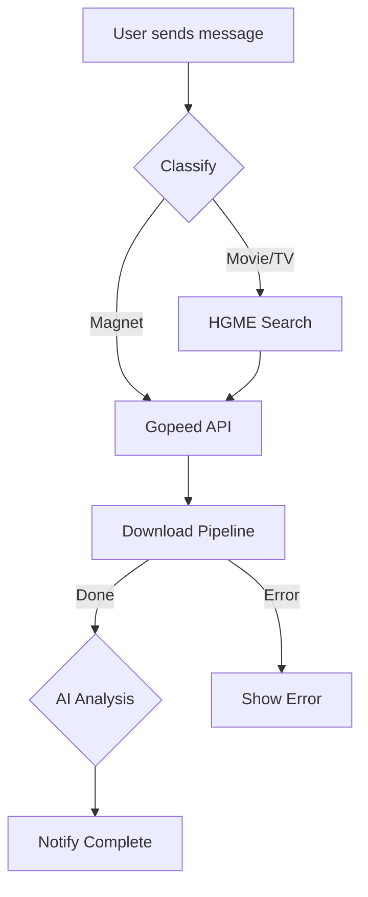

# TG-Download-Bot

Telegram download bot powered by [Gopeed](https://github.com/GopeedLab/gopeed) with AI classification, poster fetching, and intelligent routing.

## Workflow




## Features

- **Input auto-classify** — magnet links, movie/TV show names, and more
- **AI analysis** — OpenAI/Anthropic-compatible API to identify content type and clean name
- **Smart download** — auto-routes content to configured directories
- **Poster fetching** — TMDB for movies
- **Progress tracking** — real-time download progress bar via inline message updates
- **HGME search** — Chinese resource search for movies/TV shows
- **Web config UI** — Flask-based configuration panel (port 9099)

## Requirements

- Python 3.9+
- [Gopeed](https://github.com/GopeedLab/gopeed) downloader running with API enabled
- Playwright (for HGME search)
- (Optional) AI API key for content classification

## Quick Start

### 1. Deploy Gopeed

[Gopeed](https://github.com/GopeedLab/gopeed) is a fast, modern download manager supporting HTTP, BitTorrent, Magnet, and ed2k.

```yaml
# docker-compose.yml for Gopeed
services:
  gopeed:
    image: liwei2633/gopeed:latest
    container_name: gopeed
    restart: unless-stopped
    network_mode: host
    environment:
      - GOPEED_USERNAME=admin
      - GOPEED_PASSWORD=your_password
      - GOPEED_APITOKEN=your_api_token
    volumes:
      - ./config:/app/storage
      - /path/to/downloads:/downloads
```

The bot connects to Gopeed via its REST API using `X-Api-Token` header:

| Endpoint | Description |
|---|---|
| `POST /api/v1/tasks` | Create download task |
| `GET /api/v1/tasks/{id}` | Get task status |
| `DELETE /api/v1/tasks/{id}` | Cancel task |

Set `GOPEED_URL` and `GOPEED_TOKEN` in config to match your Gopeed deployment.

### 2. Deploy Bot

```bash
cp config.env.example config.env
# Fill in your config
docker compose up -d
```

## Configuration

Set via `config.env` or environment variables:

| Variable | Description |
|----------|-------------|
| `BOT_TOKEN` | Telegram bot token |
| `PROXY_URL` | HTTP proxy for Telegram API |
| `GOPEED_URL` | Gopeed REST API URL (default: `http://127.0.0.1:9999`) |
| `GOPEED_TOKEN` | Gopeed API Token (`X-Api-Token` header) |
| `AV_DEST` | Download directory one |
| `BT_DEST` | Download directory for movies/TV |
| `AI_API_URL` | OpenAI/Anthropic compatible API URL |
| `AI_API_KEY` | AI API key |
| `AI_MODEL` | AI model name |
| `HGME_ENABLED` | Enable HGME Chinese resource search |
| `HGME_USERNAME` | HGME account username |
| `HGME_PASSWORD` | HGME account password |
